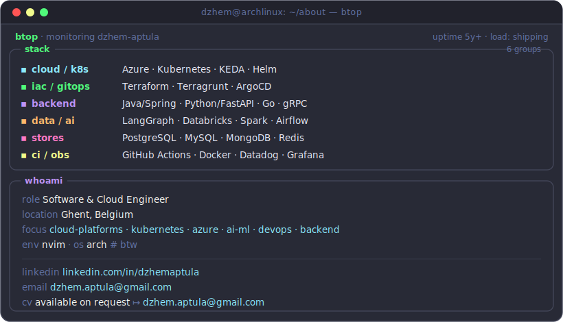

  

  
  
  
  

---

I build **cloud platforms that scale** — across backend, cloud infrastructure, AI/ML and DevOps.
I work the full lifecycle from design to delivery, and care about systems that are
**observable, secure, and built to last**.

  

### 🎧 Now playing

---

made with a — hyphen · btw I use arch 🐧
