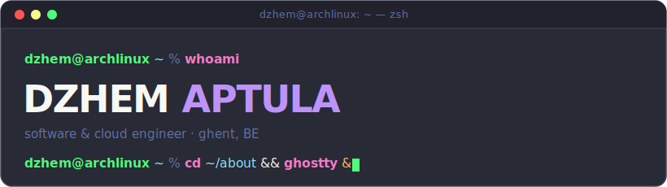

<p align="center">
  
</p>

<p align="center">
  <a href="https://www.linkedin.com/in/dzhemaptula/"></a>
  <a href="mailto:dzhem.aptula@gmail.com"></a>
  
  <a href="https://github.com/apt-dzhem"></a>
</p>

---

I build **cloud platforms that scale** — across backend, cloud infrastructure, AI/ML and DevOps.
I work the full lifecycle from design to delivery, and care about systems that are
**observable, secure, and built to last**.

```yaml
dzhem:
  role:     Software & Cloud Engineer
  location: Ghent, Belgium
  focus:    [cloud-platforms, kubernetes, azure, ai-ml, devops, backend]
  building: scalable · observable · secure systems
  editor:   nvim
  os:       arch   # btw
```

### 🧰 Stack

**Languages**


**Cloud &amp; DevOps**

![Azure][azure-badge]


**Data &amp; AI**


### 📫 Reach me

```console
dzhem@archlinux ~ % cat contact.txt
linkedin : linkedin.com/in/dzhemaptula
email    : dzhem.aptula@gmail.com
cv       : available on request  ↦  dzhem.aptula@gmail.com
```

### 🎧 Now playing

[](https://open.spotify.com/user/1167279602?si=tkoW4okiT5CWDAEUjwpwtQ)

---

<sub>made with a — hyphen · btw I use arch 🐧</sub>

[azure-badge]: https://img.shields.io/badge/Azure-282a36?style=flat-square&logo=data:image/svg+xml;base64,PHN2ZyB2aWV3Qm94PSIwIDAgMTI4IDEyOCIgeG1sbnM9Imh0dHA6Ly93d3cudzMub3JnLzIwMDAvc3ZnIj48ZGVmcz48bGluZWFyR3JhZGllbnQgaWQ9ImF6dXJlLW9yaWdpbmFsLWEiIHgxPSI2MC45MTkiIHkxPSI5LjYwMiIgeDI9IjE4LjY2NyIgeTI9IjEzNC40MjMiIGdyYWRpZW50VW5pdHM9InVzZXJTcGFjZU9uVXNlIj48c3RvcCBzdG9wLWNvbG9yPSIjMTE0QThCIi8%2BPHN0b3Agb2Zmc2V0PSIxIiBzdG9wLWNvbG9yPSIjMDY2OUJDIi8%2BPC9saW5lYXJHcmFkaWVudD48bGluZWFyR3JhZGllbnQgaWQ9ImF6dXJlLW9yaWdpbmFsLWIiIHgxPSI3NC4xMTciIHkxPSI2Ny43NzIiIHgyPSI2NC4zNDQiIHkyPSI3MS4wNzYiIGdyYWRpZW50VW5pdHM9InVzZXJTcGFjZU9uVXNlIj48c3RvcCBzdG9wLW9wYWNpdHk9Ii4zIi8%2BPHN0b3Agb2Zmc2V0PSIuMDcxIiBzdG9wLW9wYWNpdHk9Ii4yIi8%2BPHN0b3Agb2Zmc2V0PSIuMzIxIiBzdG9wLW9wYWNpdHk9Ii4xIi8%2BPHN0b3Agb2Zmc2V0PSIuNjIzIiBzdG9wLW9wYWNpdHk9Ii4wNSIvPjxzdG9wIG9mZnNldD0iMSIgc3RvcC1vcGFjaXR5PSIwIi8%2BPC9saW5lYXJHcmFkaWVudD48bGluZWFyR3JhZGllbnQgaWQ9ImF6dXJlLW9yaWdpbmFsLWMiIHgxPSI2OC43NDIiIHkxPSI1Ljk2MSIgeDI9IjExNS4xMjIiIHkyPSIxMjkuNTI1IiBncmFkaWVudFVuaXRzPSJ1c2VyU3BhY2VPblVzZSI%2BPHN0b3Agc3RvcC1jb2xvcj0iIzNDQ0JGNCIvPjxzdG9wIG9mZnNldD0iMSIgc3RvcC1jb2xvcj0iIzI4OTJERiIvPjwvbGluZWFyR3JhZGllbnQ%2BPC9kZWZzPjxwYXRoIGQ9Ik00Ni4wOS4wMDJoNDAuNjg1TDQ0LjU0MSAxMjUuMTM3YTYuNDg1IDYuNDg1IDAgMDEtNi4xNDYgNC40MTNINi43MzNhNi40ODIgNi40ODIgMCAwMS01LjI2Mi0yLjY5OSA2LjQ3NCA2LjQ3NCAwIDAxLS44NzYtNS44NDhMMzkuOTQ0IDQuNDE0QTYuNDg4IDYuNDg4IDAgMDE0Ni4wOSAweiIgZmlsbD0idXJsKCNhenVyZS1vcmlnaW5hbC1hKSIgdHJhbnNmb3JtPSJ0cmFuc2xhdGUoLjU4NyA0LjQ2OCkgc2NhbGUoLjkxOTA0KSIvPjxwYXRoIGQ9Ik05Ny4yOCA4MS42MDdIMzcuOTg3YTIuNzQzIDIuNzQzIDAgMDAtMS44NzQgNC43NTFsMzguMSAzNS41NjJhNS45OTEgNS45OTEgMCAwMDQuMDg3IDEuNjFoMzMuNTc0eiIgZmlsbD0iIzAwNzhkNCIvPjxwYXRoIGQ9Ik00Ni4wOS4wMDJBNi40MzQgNi40MzQgMCAwMDM5LjkzIDQuNUwuNjQ0IDEyMC44OTdhNi40NjkgNi40NjkgMCAwMDYuMTA2IDguNjUzaDMyLjQ4YTYuOTQyIDYuOTQyIDAgMDA1LjMyOC00LjUzMWw3LjgzNC0yMy4wODkgMjcuOTg1IDI2LjEwMWE2LjYxOCA2LjYxOCAwIDAwNC4xNjUgMS41MTloMzYuMzk2bC0xNS45NjMtNDUuNjE2LTQ2LjUzMy4wMTFMODYuOTIyLjAwMnoiIGZpbGw9InVybCgjYXp1cmUtb3JpZ2luYWwtYikiIHRyYW5zZm9ybT0idHJhbnNsYXRlKC41ODcgNC40NjgpIHNjYWxlKC45MTkwNCkiLz48cGF0aCBkPSJNOTguMDU1IDQuNDA4QTYuNDc2IDYuNDc2IDAgMDA5MS45MTcuMDAySDQ2LjU3NWE2LjQ3OCA2LjQ3OCAwIDAxNi4xMzcgNC40MDZsMzkuMzUgMTE2LjU5NGE2LjQ3NiA2LjQ3NiAwIDAxLTYuMTM3IDguNTVoNDUuMzQ0YTYuNDggNi40OCAwIDAwNi4xMzYtOC41NXoiIGZpbGw9InVybCgjYXp1cmUtb3JpZ2luYWwtYykiIHRyYW5zZm9ybT0idHJhbnNsYXRlKC41ODcgNC40NjgpIHNjYWxlKC45MTkwNCkiLz48L3N2Zz4K
